# bitmango Trade CLI 🥭

**🚀 [Download Latest Release](https://github.com/bitmango-trading/bitmango-trade-cli/releases)** (Binaries & Python SDK)

---

## What If Your Tools Matched Your Ambition?

**A command-line trading tool built for traders who are here to win.**

Every trade has three critical elements: **entry, exit, and risk management.**

This is where trades are won—or lost.

bitmango gives you direct, precise control over all three. No distractions. No friction. Just clean, repeatable execution that matches your intent every time.

---

## Why bitmango

bitmango doesn't tell you *what* to trade. It gives you complete control over *how* your trades execute.

- **Entries** optimized to reduce slippage and missed fills.
- **Exits** that trigger precisely when your conditions are met.
- **Risk controls** that enforce instantly—no hesitation, no manual friction.

Every action deliberate. Every trade structured. **Exactly as you intended.**

---

## A Stop In The Wrong Place Isn't Just A Mistake—It's A Disaster.

Getting stops right is the difference between a bad trade and a catastrophic one. 

bitmango automates your risk controls completely. Whether you use **Native Stops**, stealth **Ghost Stops**, or intelligent **Trailing Stops**, the tool handles the rest—triggering at **exactly the right moment, every time.**

Your safety nets and profit locks never slip through the cracks.

---

## Every Minute Logging Trades Is A Minute Not Trading.

bitmango logs every trade automatically—entry, exit, and risk parameters—so your records are always complete and accurate. 

Spot patterns. Sharpen your approach. Focus entirely on your edge. Time in the market is what counts. **The paperwork now takes care of itself.**

---

## Stop Writing API Hooks For Every New Exchange.

Automated trading has two parts: **your strategy** and the operations of connecting to exchanges. 

Every exchange has a different API. Without bitmango, that means writing, debugging, and rewriting code every time you switch. bitmango eliminates that entirely. Your bot sends the same commands every time. Switch exchanges by updating a config file.

**You focus on your strategy. bitmango handles the rest.**

---

 

Trading is hard. But you know the rewards are worth it.

*Imagine how much further you could go?*

# Find Out With bitmango.

---

## 🕹️ Two Specialized Modes of Operation

BitMango is designed to excel in both high-intensity manual trading and high-speed automated environments.

### 1. Manual Interaction Mode (Default)
**Best for:** Active traders managing positions in real-time. Standardized boxed output with real-time progress indicators and human-safety confirmation prompts.

### 2. Bot Mode (High-Performance JSON)
**Best for:** Automated bots, custom scripts, and external dashboards. Activated with `--output json`. Pure, exchange-agnostic JSON objects delivered to `stdout`.

---

## ⚡ BitMango Tiers

| Feature | Community (Source) | Professional (Binary) |
| :--- | :--- | :--- |
| **Unified Interface** | ✅ Included | ✅ Included |
| **Exchange Support** | ✅ All | ✅ All |
| **Native Stops (Mkt/Lmt/Trail)** | ✅ Included | ✅ Included |
| **JSON Bot Output** | ✅ Included | ✅ Included |
| **Health Monitoring** | ✅ Included | ✅ Included |
| **TWAP Smart Orders** | ❌ | ✅ **Integrated** |
| **Stealth (Ghost) Stops** | ❌ | ✅ **Integrated** |
| **CLI-Side Trailing Stops** | ❌ | ✅ **Integrated** |
| **Plugin Architecture** | ❌ (Omitted) | ✅ **Integrated** |
| **Institutional Reports** | ❌ | ✅ **Integrated** |

---

## 🗺️ Exchange Implementation Roadmap

BitMango currently supports the Top 15 global exchanges by volume. Progress indicates core feature verification (Market Data, Account, Trading).

| Exchange | Implementation Progress | Score |
| :--- | :--- | :---: |
| **BINANCE** | ██████████ | 100% |
| **BITFINEX** | ███████░░░ | 76% |
| **BITGET** | ██████████ | 100% |
| **BYBIT** | ██████████ | 100% |
| **COINBASE** | ██████░░░░ | 61% |
| **DYDX** | ██████░░░░ | 61% |
| **GATEIO** | ██████████ | 100% |
| **HTX** | ██████████ | 100% |
| **HYPERLIQUID** | ██████████ | 100% |
| **KRAKEN** | ██████████ | 100% |
| **KUCOIN** | ██████████ | 100% |
| **LBANK** | ███░░░░░░░ | 38% |
| **MEXC** | ██████████ | 100% |
| **OKX** | ██████████ | 100% |
| **PHEMEX** | ██████████ | 100% |
| **SIMULATED** | ██████████ | 100% |

*Detailed verification reports for each exchange are available in the **[Implementation Roadmap Wiki](docs/wiki/09-Implementation-Roadmap.md)**.*

---

## 🚀 Installation

### For Humans 🧑‍💻
1. **Download the Release:** Get the binary for your OS from the [Releases](https://github.com/bitmango-trading/bitmango-trade-cli/releases) page.
2. **Setup Your Vault:** `./bitmango-vault --setup` (Securely store your API keys)
3. **Explore:** Type `./bitmango-help all`

### For AI Bots 🤖
1. **Download the SDK:** Get the Python SDK from the [Releases](https://github.com/bitmango-trading/bitmango-trade-cli/releases) page.
2. **Setup Your Vault:** `./bitmango-vault --setup`
3. **Direct the AI:** *"Build a bot using bitmango on the simulated exchange"*

---

## 📖 The Trading Playbook (Wiki)

For comprehensive guides and advanced strategy deep-dives, visit our **[Official Wiki](docs/wiki/00-Home.md)**.

*   **[Deployment Guide](docs/wiki/01-Getting-Started.md)** - Get up and running in 60 seconds.
*   **[Pro Execution Strategy](docs/wiki/05-Advanced-Strategies.md)** - Mastering TWAP and Stealth Stops.
*   **[Bot Integration (JSON)](docs/wiki/06-Bot-Integration.md)** - Hook BitMango into your Python/Node/Go bots.
*   **[Risk Hardening](docs/wiki/07-Risk-Management.md)** - Setting up the global Kill-Switch.

---

## ⚖️ Licensing & Legal

*   **Community Core (MIT):** The unified CLI source code is open-source.
*   **Pro Engine (Proprietary):** The hardened binary containing advanced execution features and the plugin system is licensed for professional use. See `PRO_LICENSE.txt`.

### Disclaimer
**Traders trade at their own risk.** Crypto markets are volatile. BitMango is an execution engine, not a crystal ball. Always test your strategies in `--exchange simulated` mode before deploying capital.
